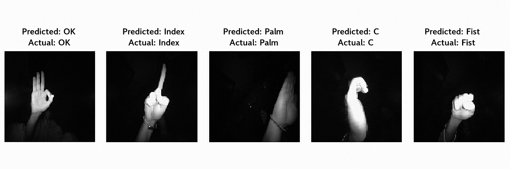
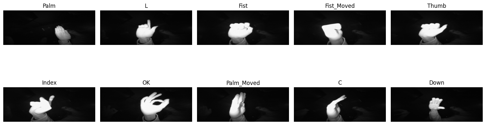
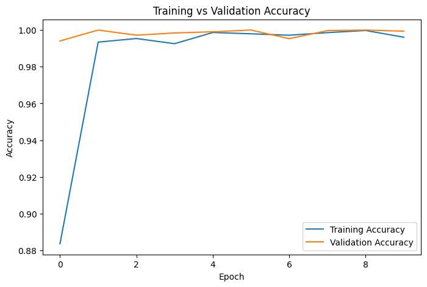
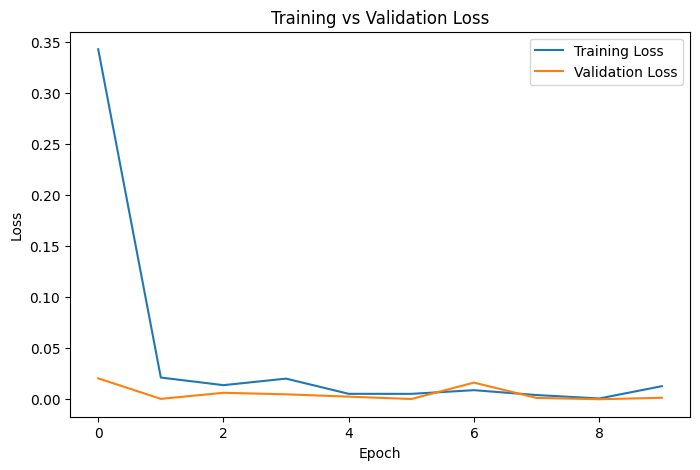

# ✋ Hand Gesture Recognition using CNN



**SkillCraft Technology - Machine Learning Internship**

**Task 04**

This project implements a **Hand Gesture Recognition System** using a **Convolutional Neural Network (CNN)**. The model is trained on the **LeapGestRecog** dataset to classify hand gestures with high accuracy.

---

## 📌 Project Overview

The objective of this project is to develop a deep learning model capable of recognizing different hand gestures from images. Such systems have applications in:

- Human-Computer Interaction
- Touchless Control Systems
- Virtual Reality
- Sign Language Recognition
- Smart Automation

---

## ✨ Features

- Image preprocessing and normalization
- CNN-based gesture classification
- High classification accuracy
- Training and validation visualization
- Sample gesture prediction
- Saved trained model for future use

---

## 🛠 Technologies Used

- Python
- TensorFlow / Keras
- OpenCV
- NumPy
- Matplotlib
- Scikit-learn

---

## 📂 Dataset

Dataset: **LeapGestRecog**

https://www.kaggle.com/datasets/gti-upm/leapgestrecog

> **Note:** The dataset is not included in this repository due to its large size.

---

## 🔄 Machine Learning Workflow

1. Download the dataset
2. Resize images to **64 × 64**
3. Normalize pixel values
4. Split into training and testing sets
5. Build the CNN model
6. Train the model
7. Evaluate performance
8. Plot accuracy and loss graphs
9. Predict sample gestures
10. Save the trained model

---

## 🖼 Sample Images



---

## 🔍 Sample Predictions


---

## 📈 Results

**Training Accuracy**



**Training Loss**



### Model Performance

- Test Accuracy: **~99–100%**
- Successfully classified **10 hand gesture classes**
- Saved trained CNN model for future inference

---

## 📁 Project Files

```
SCT_ML_4/
│── Hand_Gesture_Recognition.ipynb
│── README.md
│── requirements.txt
│── hand_gesture_model.h5
│── accuracy_graph.png
│── loss_graph.png
│── dataset_samples.png
│── sample_predictions.png
```

---

## 🚀 Future Improvements

- Real-time webcam gesture recognition
- More gesture classes
- Better performance under different lighting conditions
- Mobile deployment using TensorFlow Lite
- Gesture-controlled applications

---

## 💼 Internship

This project was completed as **Task 04** of the **Machine Learning Internship** at **SkillCraft Technology**.

---

## 👨‍💻 Author

**Amruth Raju**

GitHub: https://github.com/AmruthaRaju24

LinkedIn: https://www.linkedin.com/in/amrutharaju-gundla-10625638a

---

⭐ If you found this project useful, consider giving it a star!
